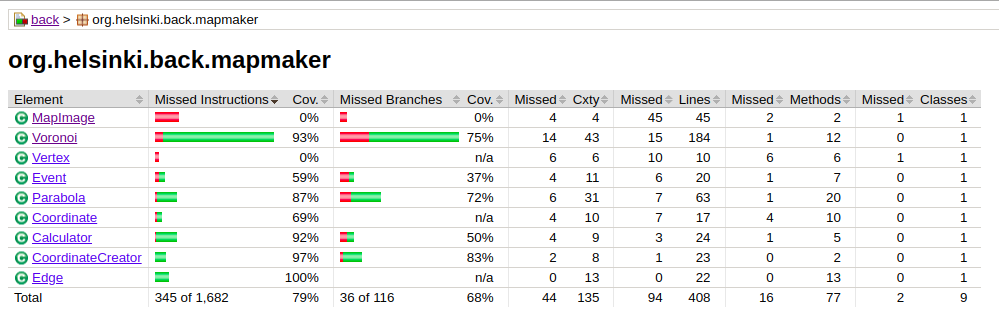

# Test documentation
## Testing
The backend can be tested from the ```/backspring``` folder with the command
```mvn test```

Test coverage report can be generated in the same folder with the command

```mvn jacoco:report```

Results will be under ```target/site/jacoco/index.html```

Testing consists of unit tests covering most of the currently existing logic of the program backend. The test framework is Jupiter.

The front end is currently a minimal page that only displays the image generated by the backend, so there are no frontend tests as of yet.

## Unit testing coverage

Current unit test coverage is 79%. All tests are currently testing classes under ```/mapmaker```, since that's where the main functionality of the program is.



A visualization of the test coverage in /mapmaper.

## Empirical testing


An image of the current front page display.

## Test data

The current test data consists of elementary cases, e.g. a 25x25-size map with three seed points. 
